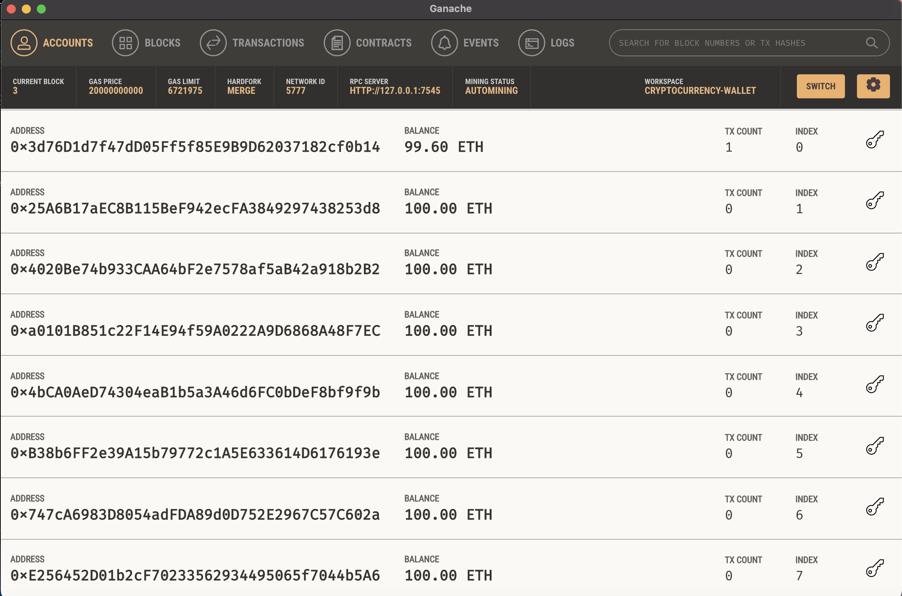
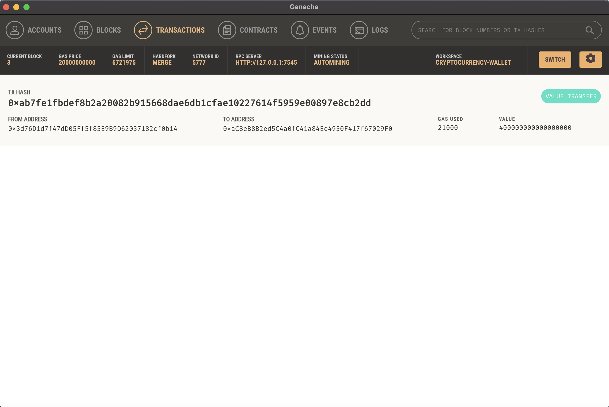
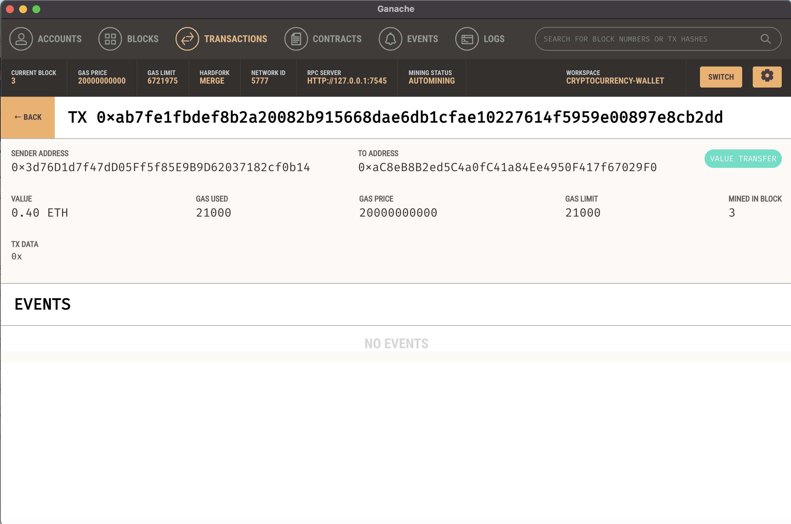

# KryptoJobs2Go Ethereum Integration

## Background
KryptoJobs2Go is a revolutionary platform designed to help customers find fintech professionals, hire them, and pay them using cryptocurrency. For this assignment, I am posing as the lead developer of KryptoJobs2Go(), I was tasked with integrating the Ethereum blockchain network into the application, enabling customers to make instant payments to the professionals they hire.

## Files Needed:
This project involves integrating Ethereum blockchain functionality into the KryptoJobs2Go application. You'll use two Python files:

- _krypto_jobs.py_: Contains the code for the web interface of the application.
- _crypto_wallet.py_: Contains Ethereum transaction functions.

## Testing
### To test the application:

- Launch the Streamlit application.
- Select a candidate, enter hours, and click "Send Transaction".
- Check transaction details in Ganache.
## Screenshots
#### Address Balance and History: 

#### Transaction Details: 

#### Validated Transaction:
 